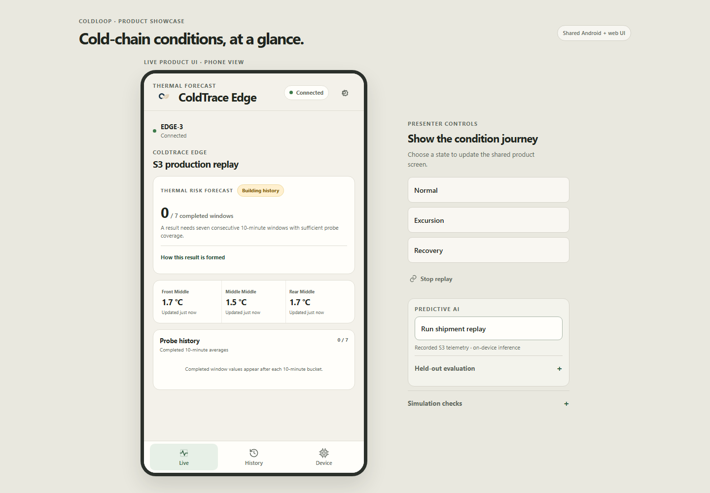

# ColdLoop + ColdTrace Edge

ColdLoop is an offline-first cold-chain monitoring demo with an ESP32-C3 sensor node, a native Android app, a responsive web app, and deterministic simulation when hardware is unavailable. ColdTrace Edge adds an experimental local thermal-risk model and replay path.

## Source map

- app/ — React, Vite, TypeScript, Capacitor Android, native BLE, web showcase, simulation/replay, and local inference source.
- firmware/ — ESP32-C3 PlatformIO source, BLE telemetry and serial JSON debug output.
- ai_bundle/coldtrace-android-ai-portable/ — EDGE-3 model, inference source, feature schema, evaluation artifacts, model card, data card and license.
- qa/ and context/ — evidence reports, journey screenshots, gates, decisions and known limits.
- wiring/WIRING.md and MORNING_RUNBOOK.md — setup, flashing and demo instructions.
- docs/assets/coldloop-brand-art.png and app/public/favicon.svg — supplied artwork and app/web mark.

BLE service: 6d6f0001-7c62-4f44-a4d2-0c5a9b2bca01. Telemetry characteristic: 6d6f0002-7c62-4f44-a4d2-0c5a9b2bca01. Packets remain 20-byte little-endian values. Firmware also emits serial JSON at 115200 baud. Demo and replay work offline.

## Web demo

From app/, run npm ci and npm run dev. Open the Vite URL for the phone app or add /showcase for the desktop presentation. Settings provides deterministic simulation, history and failure-state controls. Live web demo: https://coldloop-coldtrace-edge.netlify.app

## Android APK

Download ColdLoop-Android-debug.apk from the GitHub release. It is an installable sideloaded debug build for com.coldloop.monitor, not a Play Store-signed package. The release notes contain the APK hash.

## ESP32-C3 firmware

The complete source is under firmware/. Hardware and Wokwi firmware binaries are attached to the GitHub release. Read wiring/WIRING.md before connecting sensors; the MQ-135 analog output needs the documented voltage divider before the ESP32-C3 ADC.

## ColdTrace Edge model

The JavaScript inference pipeline runs locally. EDGE-3 expects three probe positions and seven observations over a 60-minute window with sufficient temperature and spatial coverage. A single-sensor configuration remains in warm-up or configuration-mismatch state. The model target is a processed severe thermal-risk state within 120 minutes; its score is not a probability of spoilage or food-safety risk.

The model card reports six-shipment evaluation. There is no prospective field validation, external calibration or food-safety validation. A held-out replay is a demonstration case, not independent validation. Do not use model output to approve food, estimate shelf life, change expiry dates or control refrigeration.

## Evidence and limits

The web journey covers 360x800, 390x844, 412x915 and desktop showcase states. Reports and screenshots are under qa/reports/ and qa/screenshots/. The fresh Android debug APK was built for this release; that exact artifact was not reinstalled for a final emulator journey afterward. Physical sensors and phone-to-ESP32 BLE remain unverified. See qa/FINAL_STATUS.json and MORNING_RUNBOOK.md for the status and next actions.

MQ-135 readings are broad relative signals. ENS160 eCO2 is estimated. The software does not certify food safety, identify a gas, confirm spoilage, extend expiry or claim measured food-waste reduction.

## License and attribution

ColdLoop app and firmware source use Apache-2.0 (LICENSE). The ColdTrace model bundle retains its own Apache-2.0 license and data/model disclosures. See THIRD_PARTY_NOTICES.md for attribution.
